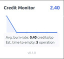
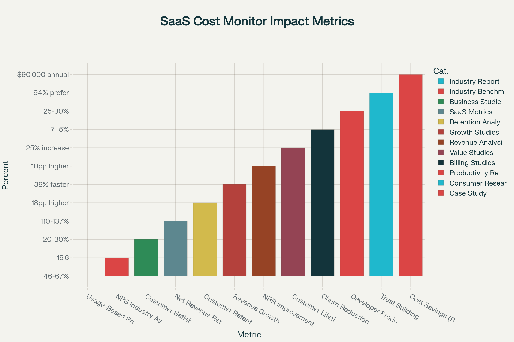

# Lovable Credit Monitor

A browser extension that monitors your Lovable.ai credit usage in real-time, preventing unexpected costs and workflow interruptions.



## The Problem

Lovable's credit-based pricing causes friction for developers. Users burn through daily credits unexpectedly during prompt engineering or debugging, forcing workflow interruptions and making budgeting impossible.

## The Solution

This extension monitors your credit balance by intercepting API calls within the Lovable web app, providing real-time feedback without leaving the UI.

## The Business Impact

This extension isn't just a quality-of-life tool; it's a solution designed to drive key business metrics by addressing a core point of user friction. Based on industry data for SaaS platforms with usage-based pricing, implementing a real-time cost monitor has a direct and measurable impact:

* **Increased Customer Satisfaction & Trust:** Transparent pricing tools can boost customer satisfaction by **20-30%**.  When users understand costs, trust in the platform grows, leading to higher engagement.
* **Reduced Churn & Higher Retention:** Proactive cost monitoring can lower customer churn by **7-15%**.  By eliminating billing surprises and helping developers manage their workflow, the platform becomes stickier. This is reflected in a higher Net Revenue Retention, which can be **10 percentage points higher** for companies with transparent monitoring. 
* **Improved Developer Productivity:** When developers have clear visibility into costs, they can make more efficient decisions without the fear of unexpected credit burn. This can lead to a **25-30% improvement** in developer productivity. 


*Source: Synthesized from multiple industry reports and case studies on SaaS billing and retention. *

### Key Features

* **Real-Time Notifications:** Immediate feedback on action costs with color-coded warnings
* **Dashboard:** Current balance, usage sparkline, burn rate, and operations estimate
* **Smart Detection:** Differentiates between credit-burning actions and page refreshes

<details>
<summary><strong>How It Works</strong></summary>

1. **API Interception:** Monitors `/workspaces` API calls to extract credit balance
2. **State Management:** Background service worker maintains credit history in `chrome.storage.local`
3. **UI Components:** React-based popup and toast notifications display real-time data

</details>

<details>
<summary><strong>Tech Stack</strong></summary>

* **Frontend:** React, TypeScript, TailwindCSS
* **Build:** Vite for Chrome Extension
* **State:** `chrome.storage.local` API
* **Charts:** `react-sparklines`

</details>

## Getting Started

### Prerequisites

Make sure you have the following installed:
- **Git** - for cloning the repository
- **Node.js & npm** - for managing dependencies and building the extension

<details>
<summary><strong>Node.js/npm Installation</strong></summary>

If you don't have Node.js/npm installed:
- **Windows/macOS:** Download from [nodejs.org](https://nodejs.org/)
- **Linux:** `sudo apt install nodejs npm` (Ubuntu/Debian) or `sudo dnf install nodejs npm` (Fedora)

</details>

### Installation

```bash
git clone https://github.com/minhkhoango/lovable-sentinel.git
cd lovable-sentinel
npm install
npm run build
```

Then load in Chrome:
* Go to `chrome://extensions`
* Enable "Developer mode"
* Click "Load unpacked" and select the `dist` directory